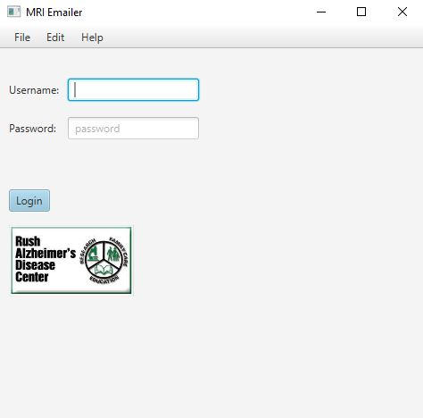
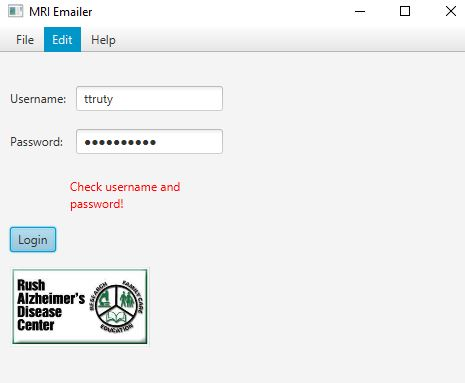
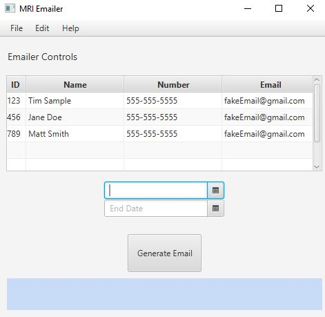
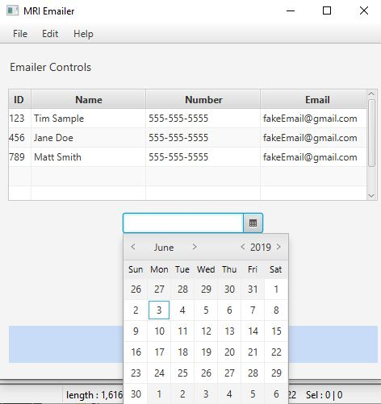
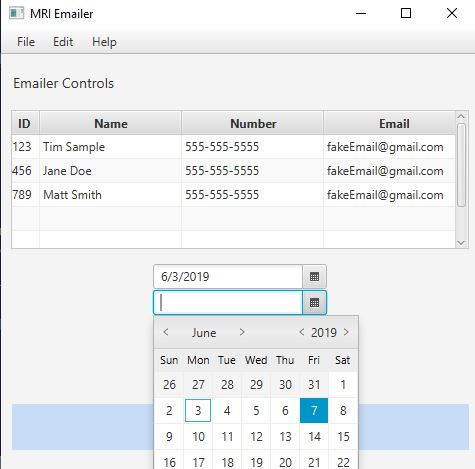
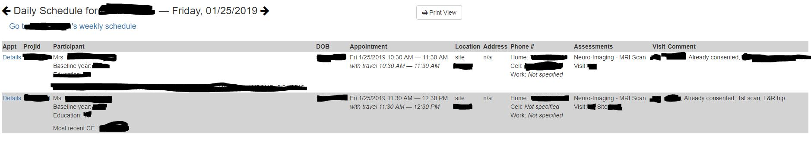
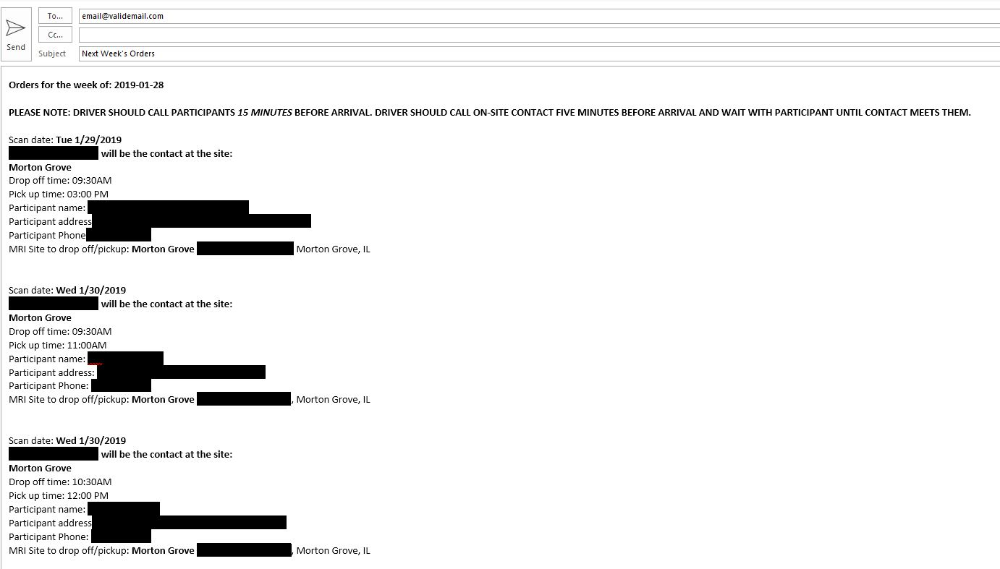

# Automate Emailer Through Webscraping JAVA port and update

## This project webscrapes a scheduling site they automatically generates a form email to be sent based on that data. Build with a simple GUI for user control.

> The program is an updated port of [this project](https://github.com/ttruty/AutomationEmailerWebscrape) 
> The GUI is updated and has more functionality

## 1. The Login Page
 
* In order to login into the scheduling site we must enter correct the correct username and password.

* The program now will check that your username and password is valid before starting the program. If invalid it will show prompt

## 2. Main View

* The changing staff (not in beta) and setting the dates to look at 

## User can set dates to focus for the emailer to check.

## 3. The schedule that the program is webscraping looks like this
- Many redactions to protect privacy but the imortant part is the date and time info. 
- There is a schedule for each day for each staff memeber so the program polls each one to make sure there is an mri appointment and then pulls the date and time info as well as the location of the scan. (only 2 locations)

## 4. The resulting email looks like below.
- Can specify email address and cc as well as make it automatically send

